#+TITLE: markdown-ts-mode
#+AUTHOR: Rahul M. Juliato
#+EMAIL: rahul.juliato@gmail.com

[[https://melpa.org/#/markdown-ts-mode][file:https://melpa.org/packages/markdown-ts-mode-badge.svg]]

A major mode for Emacs providing syntax highlighting for Markdown
files using tree-sitter.

Emacs 31 (current master, not yet released) ships ~markdown-ts-mode~
as a built-in.  This package brings the same mode to *Emacs 30*,
with compatibility shims for APIs that only exist in Emacs 31.  If
you are already running Emacs 31, you do not need this package.

Please note this provides basic functionality.  If you're looking
for a fully featured mature mode, please consider [[https://jblevins.org/projects/markdown-mode/][markdown-mode]].

** Install

*** 1. Install the tree-sitter grammars

You need *both* the ~markdown~ and ~markdown-inline~ grammars.  On
Emacs 30, use grammar version *v0.4.1* (ABI 14).  Version 0.5.x
requires ABI 15 which is only available in Emacs 31+.

Add the grammar sources to your ~init.el~:

#+BEGIN_SRC elisp
  (add-to-list 'treesit-language-source-alist
    '(markdown
      "https://github.com/tree-sitter-grammars/tree-sitter-markdown"
      "split_parser" "tree-sitter-markdown/src"))
  (add-to-list 'treesit-language-source-alist
    '(markdown-inline
      "https://github.com/tree-sitter-grammars/tree-sitter-markdown"
      "split_parser" "tree-sitter-markdown-inline/src"))
#+END_SRC

Then install them:

#+BEGIN_SRC
  M-x treesit-install-language-grammar RET markdown RET
  M-x treesit-install-language-grammar RET markdown-inline RET
#+END_SRC

If you're only seeing partial highlighting, one of the grammars is
probably missing.

*** 2. Install the package

This package is available on MELPA.  Add to your ~init.el~:

#+BEGIN_SRC elisp
  (use-package markdown-ts-mode
    :mode ("\\.md\\'" . markdown-ts-mode))
#+END_SRC

Alternatively, download ~markdown-ts-mode.el~ to a directory of your
liking and add it to your load path:

#+BEGIN_SRC elisp
  (add-to-list 'load-path "~/your_preferred_dir/")

  (use-package markdown-ts-mode
    :mode ("\\.md\\'" . markdown-ts-mode))
#+END_SRC

** Emacs 30 Limitations

On Emacs 30, tree-sitter range settings are unavailable (~:range-fn~
and ~:embed function~ were added in Emacs 31).  This means:

- *No embedded language highlighting in fenced code blocks.*  A Python
  or JavaScript code block will not receive language-specific syntax
  highlighting.  Code blocks are highlighted with a generic face.
- *No scoped inline parsing.*  Both the ~markdown~ and
  ~markdown-inline~ parsers see the entire buffer rather than being
  scoped to their respective node ranges.

Everything else works: headings, emphasis, bold, links, code spans,
block quotes, lists, imenu, outline navigation, and hide-markup.

** FAQ
**** Why not use the "main" branch of tree-sitter-grammars repository?
Visit the tree-sitter-grammars repository, you'll get redirected to
the ~split_parser~ branch, since this is the default branch nowadays.

If you visit the ~main~ branch, there's a note communicating it is not
used anymore on the ~README.md~ file.

**** Why do I have to install TWO grammars?
The developers of tree-sitter-markdown decided some years ago there
would be 2 parsers, one for the "body" part of documents and one for
"inline" statements.

If you're only seeing part of your markdown files highlighted, one
of the grammars is probably missing.

** Usage

Visit a markdown file.  Turn on the mode with ~markdown-ts-mode~.

Navigate through headings with ~imenu~.

Toggle markup visibility with ~markdown-ts-toggle-hide-markup~.

** Screenshots

This shows the text provided by [[https://github.com/mxstbr/markdown-test-file/blob/master/TEST.md][TEST.md]] file, with syntax highlighting using tree-sitter.

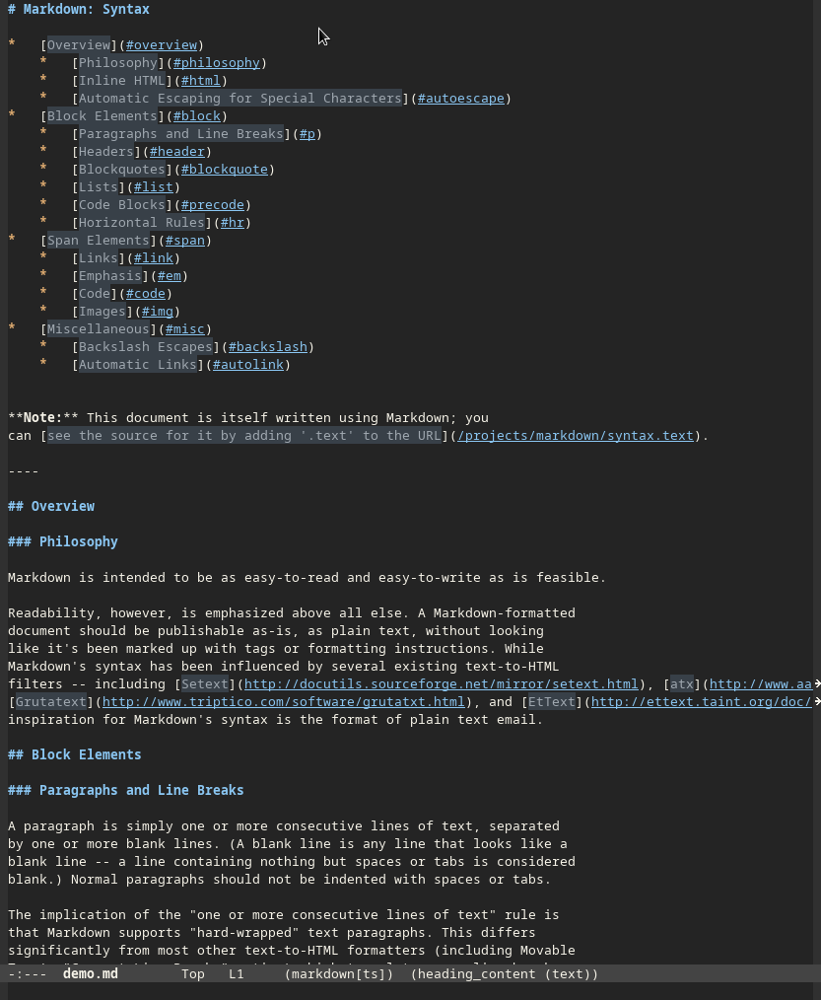

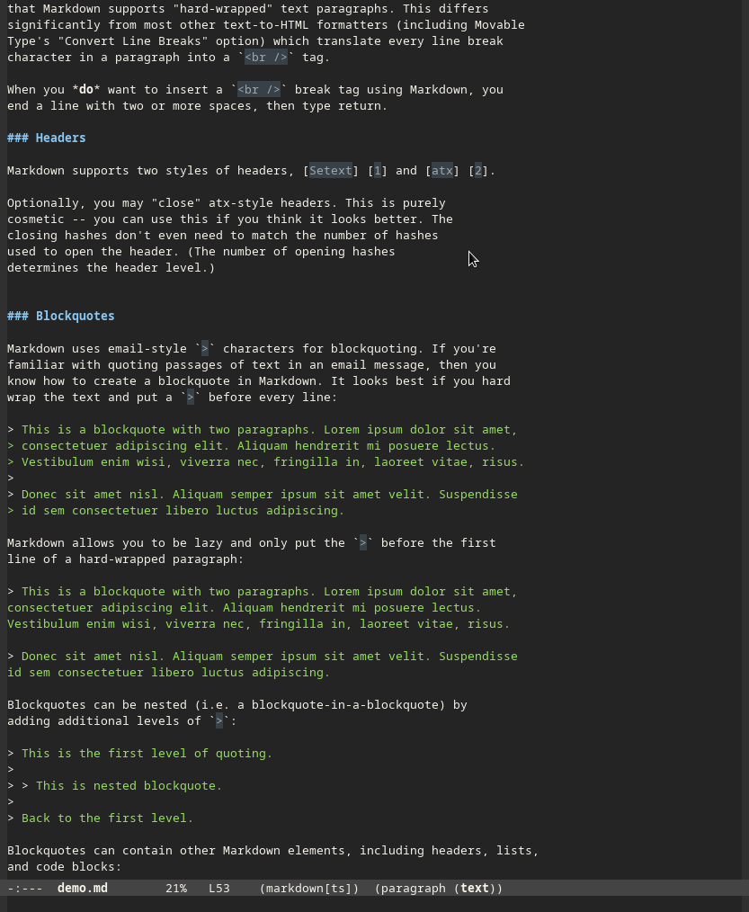

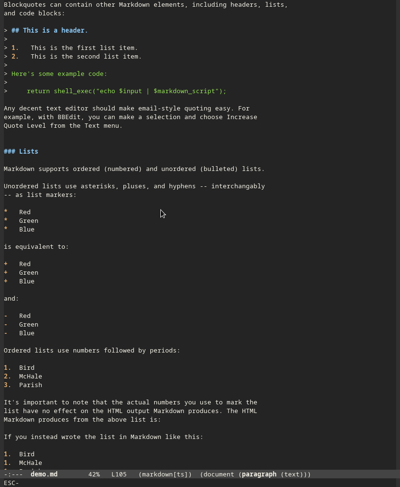

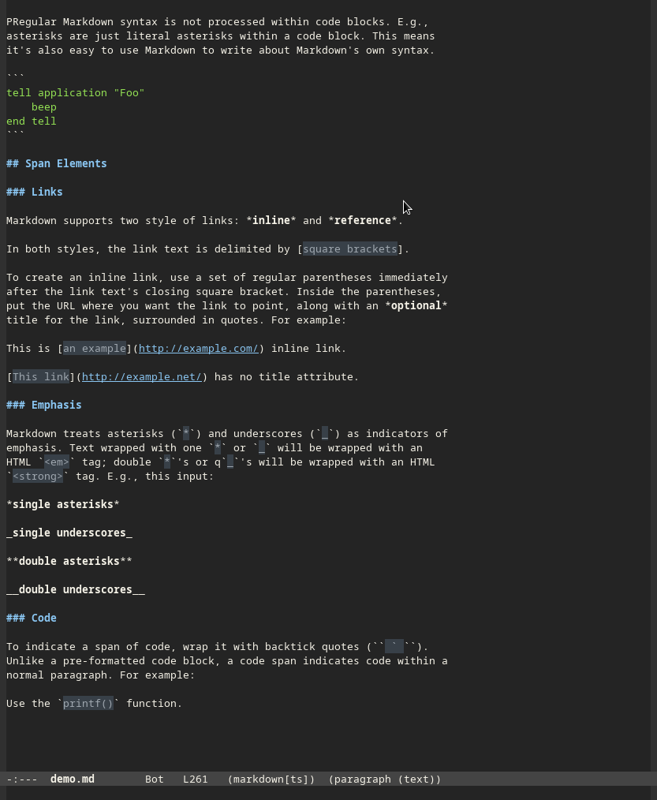

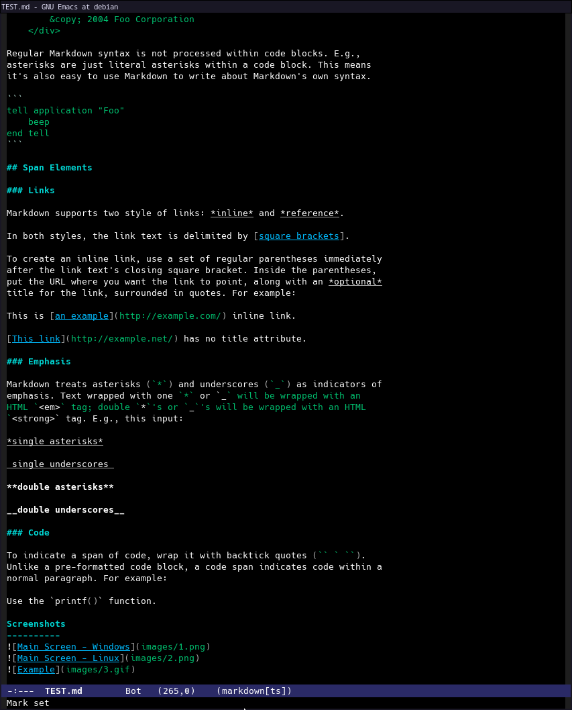

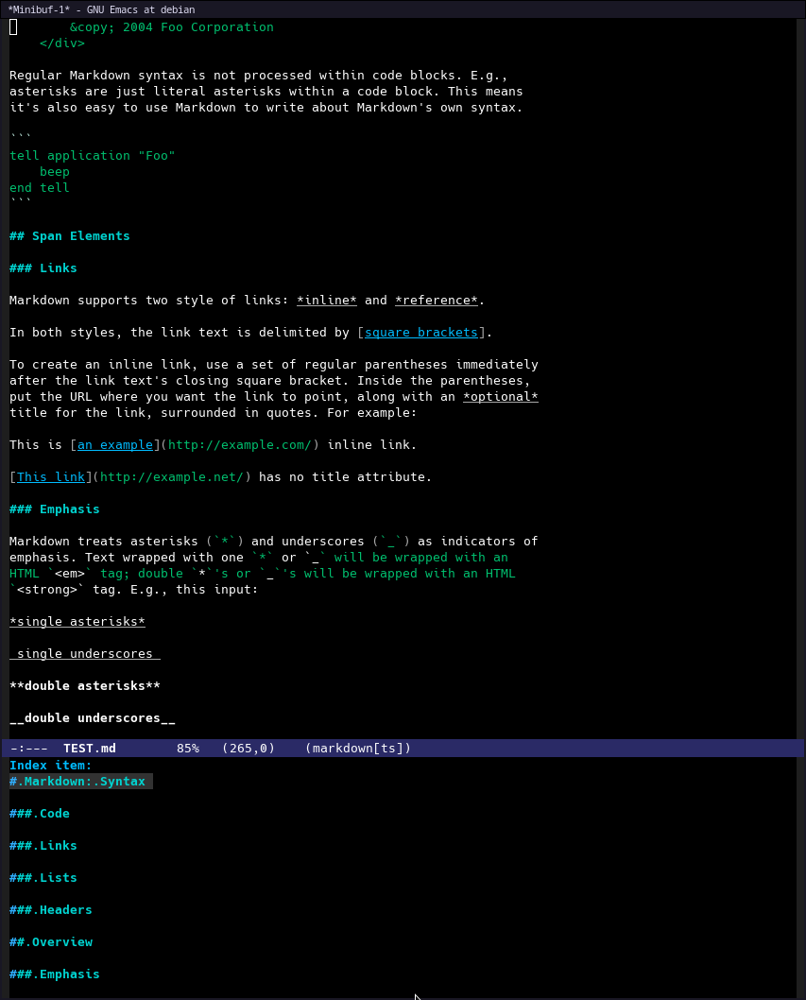

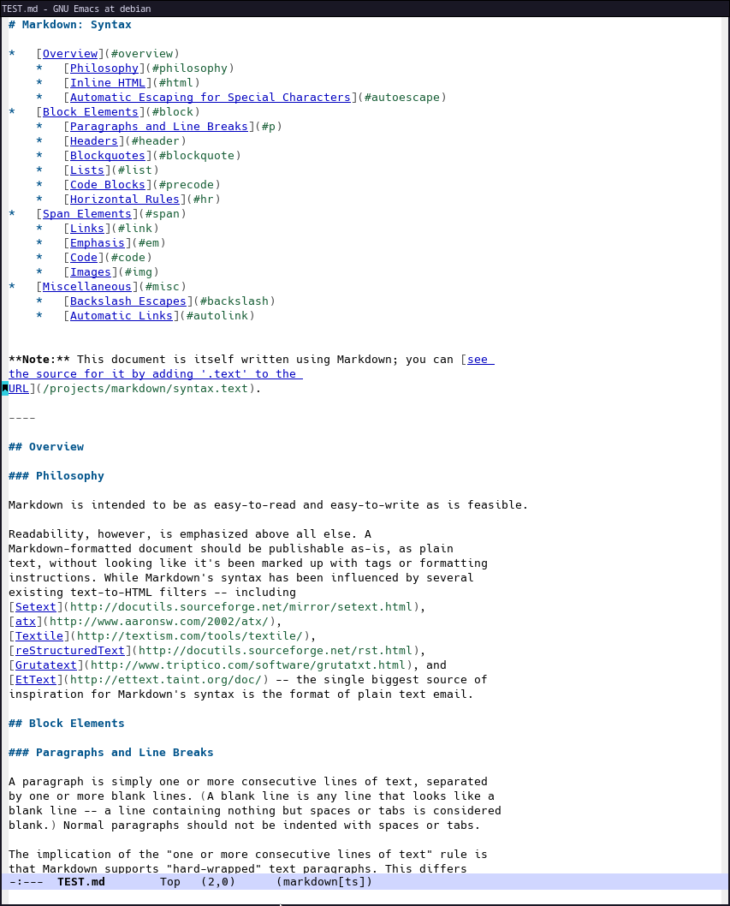

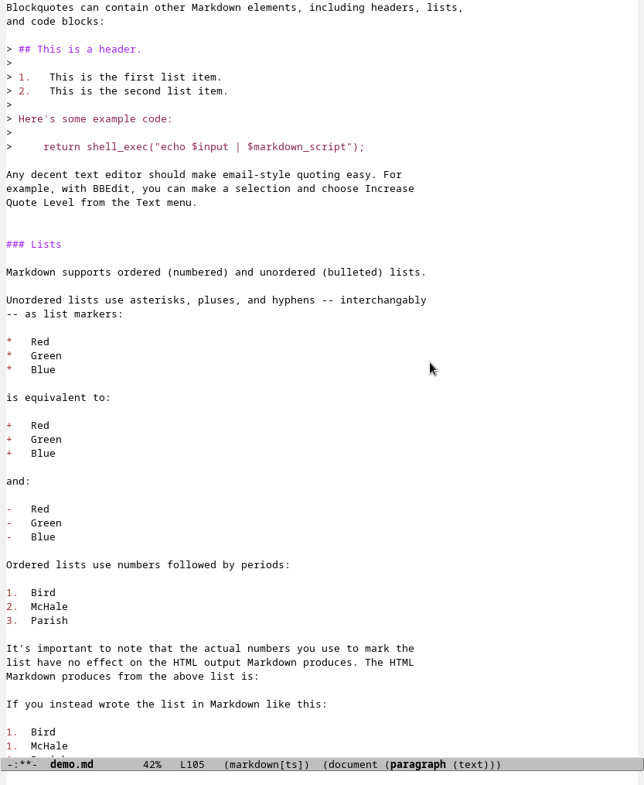

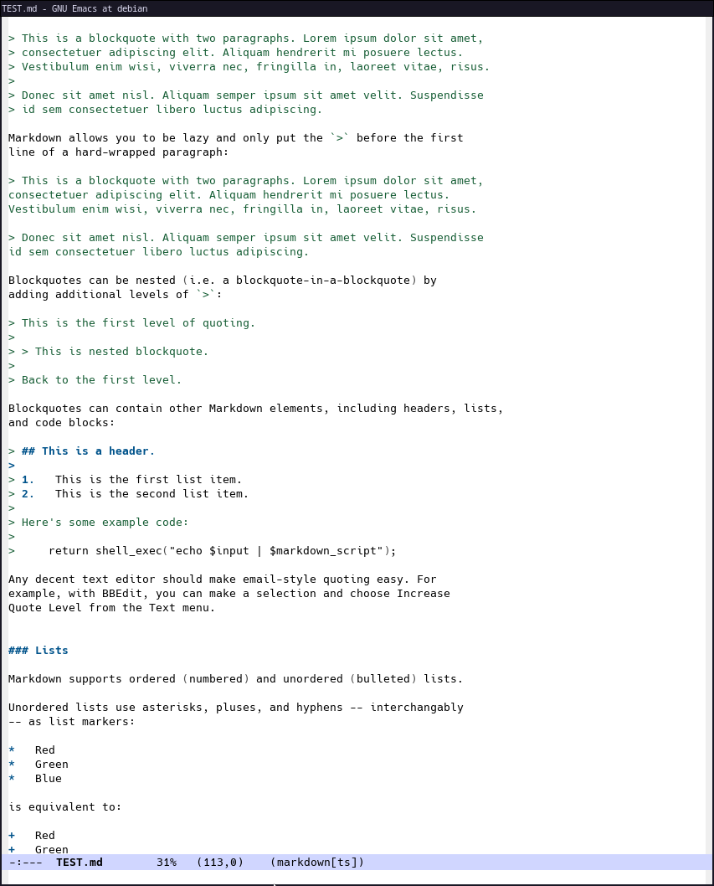

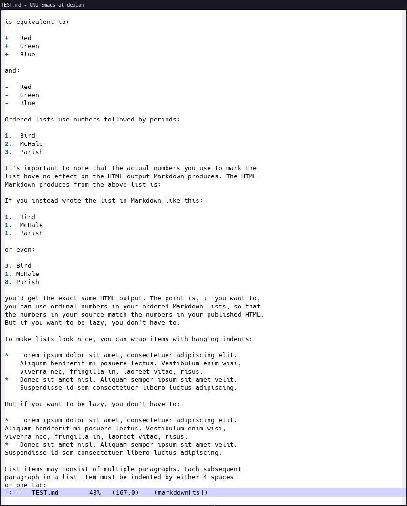

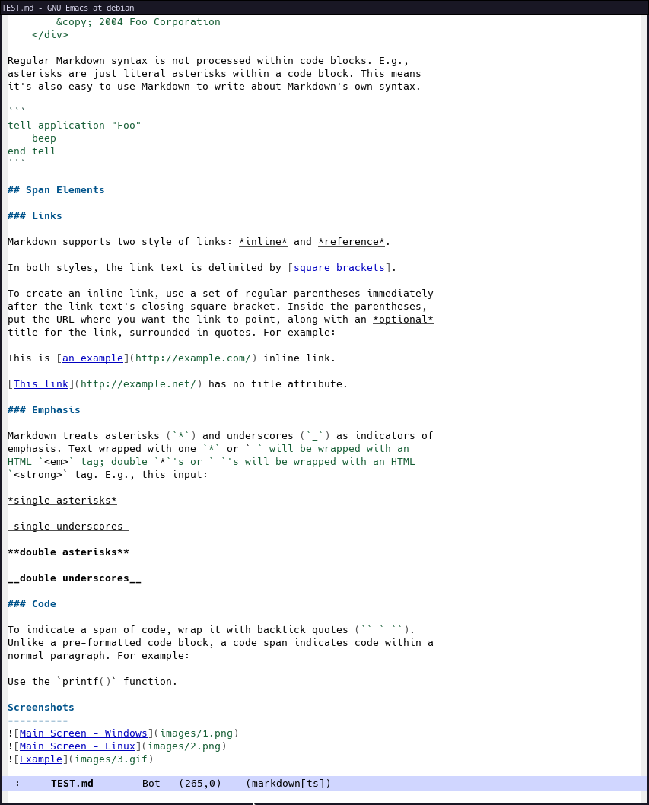

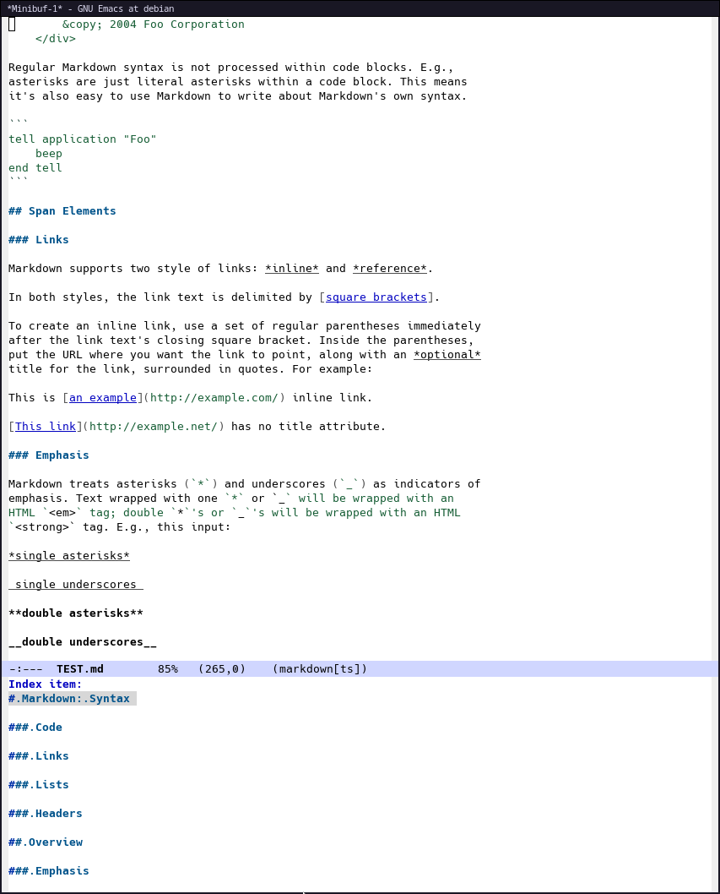

** Contributing

To contribute, submit a pull request or report a bug.  This package is
aspiring to be part of GNU ELPA.  Major contributions must be from
someone with FSF papers.
